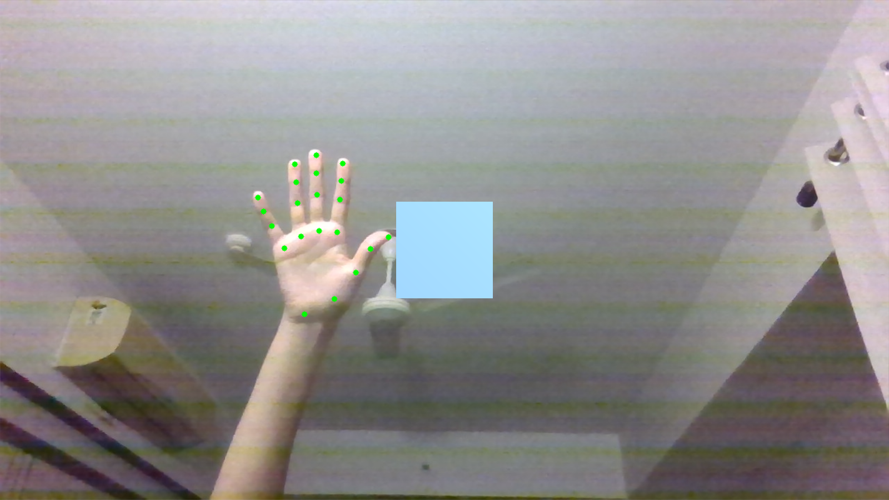
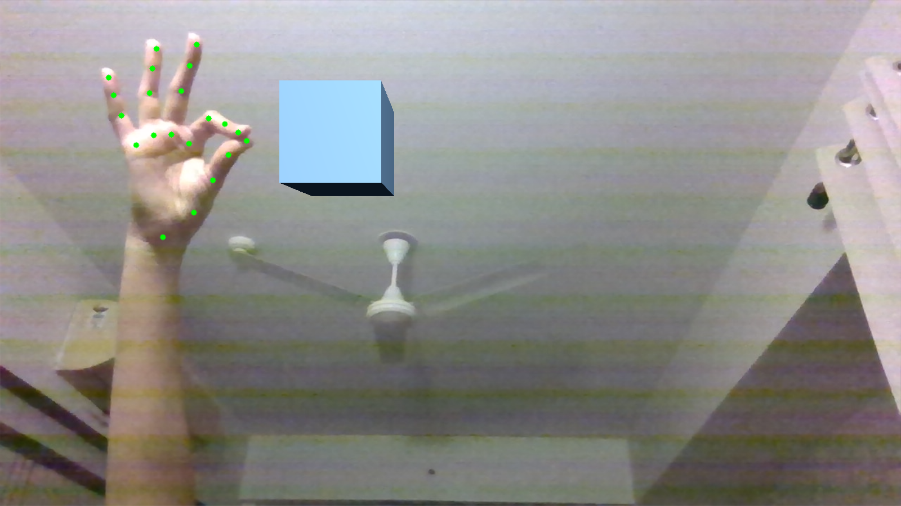
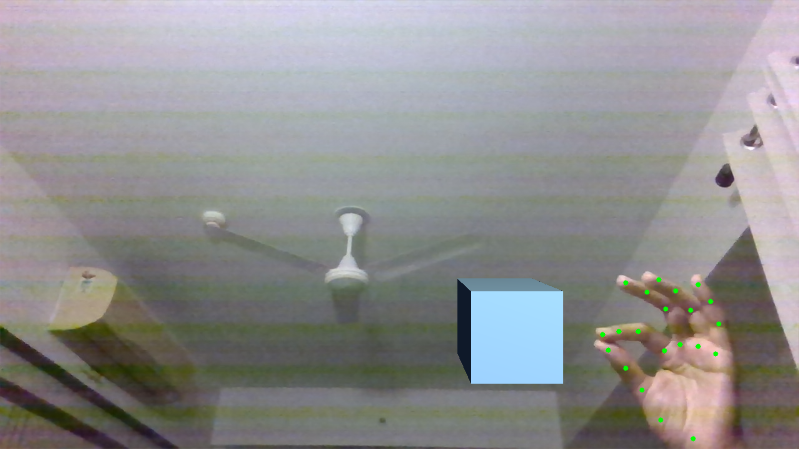
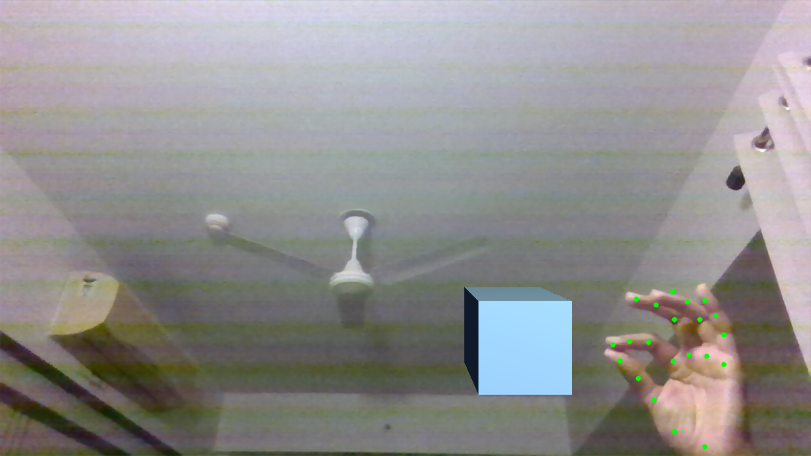
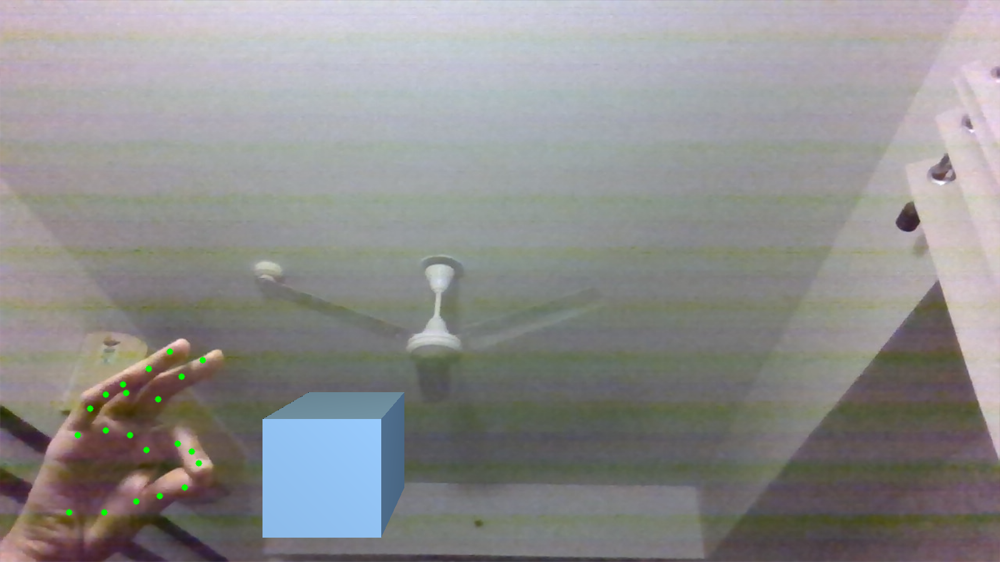

# Gesture-Controlled Mixed Reality Cube

  

A real-time mixed reality system that detects 21 hand landmarks using Computer Vision and maps hand gestures to interactively control a mathematically rendered 3D cube with custom textures and shading.

---

## Features

* Real-time hand detection and 21-point landmark tracking
* Gesture-to-transformation mapping (translation)
* Custom 3D transformation matrices (no external rendering engine)
* Manual perspective projection (3D → 2D pipeline)
* Depth-based face shading for realism
* Live mixed reality overlay on webcam feed

---

## Demo

### Hand Landmark Tracking using OpenCV

  

### Cube Projection & Shading

The cube is projected onto the 2D camera frame using manually implemented rotation matrices and perspective division, then shaded based on face orientation to simulate depth and lighting.

---

  

## How It Works

  

### 1. Hand Detection

  

* Captured live video

* Extracted 21 landmark coordinates using OpenCV

* Tracked landmark movement frame-by-frame

  

### 2. Gesture Interpretation

  

* Computed distances and angles between selected landmarks (index finger and thumb to detect pinch)

* Mapped gesture states to cube transformations:

  

* Pinch → Pickup and Control the Cube

* Release Pinch -> Drop the Cube at its current location

  
  

### 3. Custom 3D Graphics Pipeline

  

The cube was rendered without a graphics engine.

  

Implemented manually:

  

* 3D vertex representation

* Rotation matrices (X, Y, Z axes)

* Translation vectors

* Scaling transformations

* Perspective projection (3D → 2D)

* Face normal computation

* Basic lighting model for shading

  

All transformations are updated in real time based on gesture input.

  

---

  

## Installation

  

**Note:** Make sure to use python version 3.10 to prevent Mediapipe issue

  

	git clone https://github.com/Leviethal/boxelXR.git

	cd boxelXR

	python -m venv venv

	venv\Scripts\activate

	pip install -r requirements.txt

	python app.py

  

Make sure:

  

* Webcam is connected

* Lighting is sufficient

* Hand is within camera frame

  
  
  
  

## Future Improvements

  

* Implement full Phong shading model

* Add z-buffering for proper depth handling

* Support multiple 3D objects

* Integrate depth estimation for better spatial alignment

* Extend to full mixed reality world-building